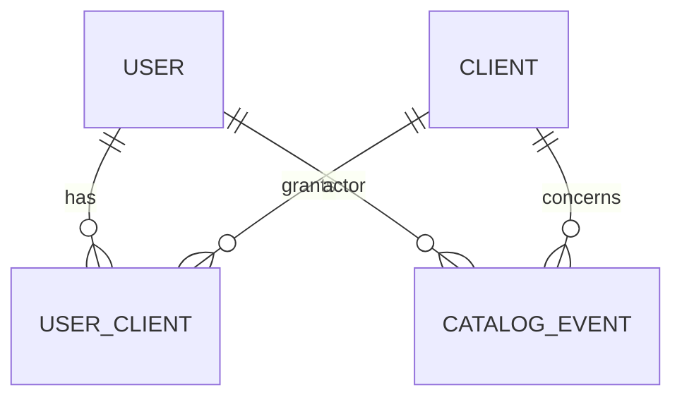

# Catalog (Control-Plane) Data Model — Draft v0.1

**Status:** Draft v0.1 — companion to the tenant data model spec (`Compliance-Manager-Data-Model.md`).
**Scope:** the **catalog** database — the control-plane directory for the multi-tenant system. It lives on its **own dedicated Flexible Server**, separate from the per-tenant compliance databases, and holds only: global settings, clients (tenants), users, their memberships, and a control-plane audit trail. **No compliance data and no per-client settings live here** — those live in each tenant's own database on its own server.

---

## 1. Design principles

1. **Control-plane vs data-plane.** The catalog is a directory the apps read to resolve *which* tenant database a request belongs to and *who* may reach it. It never holds tenant compliance data.
2. **No secrets stored.** Users have no passwords (Entra owns credentials). Clients store a *reference* to the tenant connection (or nothing, under Entra auth) — never a connection string.
3. **Users are centralized, not per-tenant.** A single global `user` plus a `user_client` join is what makes both (a) one user accessing multiple client databases, and (b) delegated per-client administration, work cleanly. Putting users in each tenant DB would break both.
4. **Tenant isolation is physical.** Because each tenant is on its own server, no row-level security is needed for tenant *data* isolation. Access control (which client a user may reach, and delegated admin scope) is enforced at the **app layer** via `user_client` membership.
5. **Append-only audit.** Control-plane actions (provisioning, access grants/revokes) are recorded immutably in `catalog_event`, mirroring the tenant `event_log`.

**Conventions:** `uuid` PKs; `*_id` are foreign keys; `jsonb` for flexible payloads; `created_at` / `updated_at` on every table unless noted.

---

## 2. Tables

### `client` — one row per tenant; the routing record to that tenant's own Flexible Server
| Field | Type | Notes |
|---|---|---|
| id | uuid PK | |
| name | string | Client / org display name |
| slug | string, unique | Stable short code — Azure resource naming + URLs |
| status | enum | `provisioning` / `active` / `suspended` / `archived` |
| region | string | Azure region (data residency / routing) |
| db_server_fqdn | string | Tenant Flexible Server FQDN |
| db_name | string | Database name on that server |
| db_auth_mode | enum | `entra` / `secret` — how the app authenticates to this tenant DB |
| db_secret_ref | string, nullable | Key Vault secret URI; null when `db_auth_mode = entra` |
| azure_resource_id | string, nullable | Flexible Server ARM id — for mgmt-plane ops (PITR, scale) |
| last_migrated_version | string, nullable | Cached schema version applied to this tenant DB |
| last_migrated_at | timestamp, nullable | Supports the migration fan-out skew check |
| onboarded_at | timestamp, nullable | When activated |

### `user` — global identity at the control-plane level (no password; Entra owns credentials)
| Field | Type | Notes |
|---|---|---|
| id | uuid PK | |
| idp | enum | `workforce` / `external` — which Entra authority issued this identity |
| subject_id | string | The identity's subject / object id in that authority. Unique on (idp, subject_id) |
| email | string | For display + lookup |
| display_name | string | |
| is_platform_admin | bool | Platform operators (admin app); orthogonal to per-client roles |
| status | enum | `active` / `disabled` / `invited` |
| last_login_at | timestamp, nullable | |

### `user_client` — many-to-many membership; one row per (user, client) grant with a per-client role
| Field | Type | Notes |
|---|---|---|
| id | uuid PK | Unique constraint on (user_id, client_id) |
| user_id | uuid FK → user | |
| client_id | uuid FK → client | |
| role | enum | `client_admin` / `editor` / `viewer` / `external` |
| status | enum | `active` / `invited` / `revoked` — revoke without deleting (audit) |
| granted_by | uuid FK → user, nullable | Who granted access |
| granted_at | timestamp | |

### `setting` — global platform settings only (per-client settings live in the tenant DB)
| Field | Type | Notes |
|---|---|---|
| id | uuid PK | |
| key | string, unique | e.g. `provisioning.default_region`, `provisioning.default_sku`, `provisioning.max_active_clients` |
| value | jsonb | |
| description | text | |
| updated_by | uuid FK → user, nullable | |

### `catalog_event` — immutable control-plane audit trail (append-only)
| Field | Type | Notes |
|---|---|---|
| id | uuid PK | |
| event_type | string | `client_provisioned` / `client_suspended` / `client_archived` / `access_granted` / `access_revoked` / `user_disabled` / `migration_applied` / `settings_changed` … |
| actor_type | enum | `user` / `system` / `pipeline` |
| actor_id | string, nullable | `user.id`, or a service principal / managed identity id |
| client_id | uuid FK → client, nullable | Null for platform-wide events |
| target_type / target_id | string / string, nullable | What was acted on (e.g. a `user_client` row) |
| payload | jsonb | Event detail |
| occurred_at | timestamp | Append-only; no `updated_at` |

---

## 3. Enumerations
- `client.status`: `provisioning` / `active` / `suspended` / `archived`
- `client.db_auth_mode`: `entra` / `secret`
- `user.idp`: `workforce` / `external`
- `user.status`: `active` / `disabled` / `invited`
- `user_client.role`: `client_admin` / `editor` / `viewer` / `external`
- `user_client.status`: `active` / `invited` / `revoked`
- `catalog_event.actor_type`: `user` / `system` / `pipeline`

---

## 4. Identity & authentication model
- **Internal / staff users** authenticate against the **workforce Entra tenant** (the standard Entra ID bundled with the Microsoft subscription). Conditional Access (Entra ID **P1**) is applied to the admin app for the small set of platform admins.
- **External users** (contractors, attorneys, expediters) authenticate against a **separate Entra External ID external tenant**, using **email one-time passcode** — no password, and no guest objects in the corporate workforce directory. The external tenant keeps external identities fully isolated from the staff directory.
- Both authorities issue OIDC tokens validated by the apps in one pipeline; the `user.idp` field tells the app which authority issued a given identity.
- **No credentials are stored in the catalog.** "Adding a user" creates the `user` row (subject id only) and the `user_client` grant; the identity itself lives in Entra. *Open:* whether admins may *invite* brand-new external identities (Graph against the external tenant) vs only grant access to existing ones.

---

## 5. Access model (two admin tiers)
| Actor | Provision clients / servers | Manage a client's users | Compliance work | Read |
|---|---|---|---|---|
| platform admin (admin app) | yes | — | — | yes |
| client_admin (main app) | no | yes — own client only | yes | yes |
| editor | no | no | yes | yes |
| viewer | no | no | no | yes |
| external | no | no | limited | limited |

- **Platform admins** (`is_platform_admin = true`) operate the **admin app**: create clients, provision databases, manage users platform-wide, run schema migrations.
- **`client_admin`s** manage users **for their own client(s) only**, from a scoped section of the **main app** — which therefore holds *scoped write* on `user` / `user_client` (not full read-only). Enforced app-layer; optional Postgres RLS on `user_client` as later defense-in-depth.

---

## 6. Provisioning lifecycle (one-click)
A single admin action triggers an async, status-tracked orchestration (server creation takes minutes):
1. Admin app writes a `client` row (`status = provisioning`) and logs a `catalog_event`.
2. A **provisioner identity** (dedicated, not the runtime app identity) triggers a **Bicep/ARM template deployment** to create the tenant Flexible Server — keeping one-click UX while the template stays version-controlled and idempotent. RBAC is a **custom role scoped to one resource group**, allowing only Postgres-server create/config — no delete (deprovisioning stays deliberate).
3. Configure the new server (Entra admin, networking), create the app database + role, run EF Core migrations + seed.
4. Create/link the **initial `client_admin`** user (`user` + `user_client(role = client_admin)`) from the email captured on the add-client form.
5. Write routing back to the `client` row, flip `status` to `active`, log `client_provisioned`.

Guardrail: a `provisioning.max_active_clients` setting bounds runaway creation; subscription quotas are the backstop.

---

## 7. Relationships

---

## 8. Open items
1. Invite-new vs grant-existing for external identities (Graph permissions on the admin/main app).
2. RLS on `user_client` as defense-in-depth for the delegated-admin write surface (deferred; app-layer enforcement first).
3. Confirm minimal add-client form fields (name + initial admin email; region/SKU default from `setting`).

---

## 9. Changelog
- **v0.1** — initial catalog model: `client`, `user`, `user_client`, `setting`, `catalog_event`; identity model (workforce + External ID external tenant, email OTP); two-tier access model; one-click templated provisioning.
