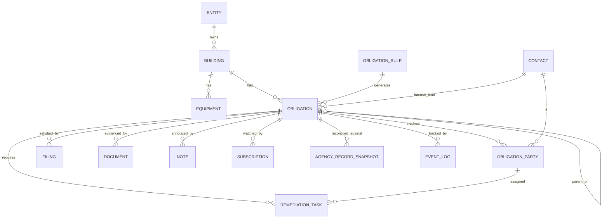

# Compliance Manager — Data Model (Draft v0.2)

**Status:** Draft v0.2 — for review before infrastructure design
**Scope:** Unified data model for tracking NYC HPD violations, OATH-adjudicated violations (DEP/DSNY/DOHMH), and recurring Local Law filing obligations, in one engine.
**Audience:** Internal — system design review.
**Changes since v0.1:** added `entity`, `obligation_party`, `note`, `subscription`, `proof_requirement`; added `internal_lead_id` to `obligation`; moved entity to `building`; reworked `remediation_task` cost fields for ERP integration; split documents into required-proof vs. supporting.

---

## 1. Design Principles

1. **One unified core, two triggers.** A single `obligation` entity represents both *reactive* items (agency-issued violations) and *proactive* items (recurring Local Law filings). They share the deadline engine, state machine, filings, documents, reconciliation, and audit trail.
2. **Rules-driven generator, not per-law engines.** Recurring obligations are materialized by one generator that reads `obligation_rule` rows; variation lives in a small set of `recurrence_strategy` values, not in code per law.
3. **Deterministic core; AI at the edges.** Every field that drives a deadline, applicability, penalty, or "filed/accepted" determination is rules-derived or feed-sourced — never AI-written. AI may *propose* values, only through `field_provenance` in an unconfirmed state.
4. **Single source of truth per concern.** The tracker does not duplicate what another system owns. The **ERP** is the financial system of record (cost classification + job-cost progression live there); the **agency feed** is the compliance record of truth (status/closure). The tracker holds operational state plus the keys to reconcile against both.
5. **Belief vs. record.** Internal state is kept separate from observed agency records (`agency_record_snapshot`) and posted ERP actuals, so the two can be diffed.
6. **Append-only audit.** Every state change and action is recorded in an immutable `event_log`.

**Conventions:** `uuid` PKs; `*_id` are foreign keys; `jsonb` for flexible/config payloads; `enum` values listed in §8; all entities carry `created_at` / `updated_at` unless noted.

---

## 2. Identity & Profile

### `entity` *(new in v0.2)*
The owning legal entity / SPE. A multi-building portfolio is typically one SPE per building.

| Field | Type | Notes |
|---|---|---|
| id | uuid PK | |
| legal_name | string | |
| entity_type | enum | `llc` / `lp` / `corp` / `individual` |
| erp_entity_code | string | Maps to the ERP book/entity |
| active | bool | |

### `building`
Identity spine + applicability attributes. **Entity lives here**, inherited by everything below.

| Field | Type | Notes |
|---|---|---|
| id | uuid PK | |
| entity_id | uuid FK → entity | Owning SPE — costs inherit entity through the building |
| bbl | string, unique | Borough-Block-Lot — primary join key to HPD feed |
| bin | string | Building Identification Number |
| address / borough / zip | string / enum / string | |
| tax_block | string | Drives FISP & other block-cohort cycles |
| community_district | string | Drives LL152 / PIPS cohort cycles |
| gross_sq_ft | int | Applicability (LL84/LL97 ≥ 25,000) |
| stories | int | Applicability (FISP > 6) |
| year_built | int | Applicability (lead pre-1960; etc.) |
| residential_units / total_units | int | Applicability / mold two-vendor rule (> 10) |
| occupancy_type | string | |
| hpd_registration_id | string | |
| hpd_reg_status | enum | `current` / `expired` / `unknown` — gates certification |
| hpd_reg_expires | date | Monitored, alertable |

### `equipment`
Inventory for equipment-driven obligations (boiler/elevator/cooling-tower filings).

| Field | Type | Notes |
|---|---|---|
| id | uuid PK | |
| building_id | uuid FK → building | |
| equipment_type | enum | `boiler_high_pressure` / `boiler_low_pressure` / `elevator` / `cooling_tower` / … |
| device_number | string | |
| attributes | jsonb | |
| active | bool | |

### `contact`
People/firms — internal staff, vendors, and filers.

| Field | Type | Notes |
|---|---|---|
| id | uuid PK | |
| type | enum | `internal` / `super` / `vendor` / `expediter` / `attorney` / `engineer` / `owner` / `agent` |
| name / company | string | |
| email / phone | string | |
| certifications | jsonb | e.g., EPA lead-firm cert, mold license, PE — used to validate eligibility |

---

## 3. Core: Obligations & Rules

### `obligation`
The heart of the system. One row per violation **or** per generated Local Law filing instance.

| Field | Type | Notes |
|---|---|---|
| id | uuid PK | |
| building_id | uuid FK → building | |
| internal_lead_id | uuid FK → contact | **(new)** Accountable internal owner; default watcher + escalation target |
| obligation_type | enum | `reactive_violation` / `recurring_filing` |
| paradigm | enum | `hpd_certify` / `oath_summons` / `ll_filing` / `ll_inspection_filing` |
| source_authority | enum | `HPD` / `DOB` / `OATH` / `DEP` / `DSNY` / `DOHMH` / `FDNY` |
| source_system | enum | `opendata_wvxf` / `opendata_oath_jz4z` / `dob_now_safety` / `portfolio_manager` / `dob_emissions` / `internal_generator` |
| source_record_id | string | Agency violation ID / summons # / filing ID |
| rule_id | uuid FK → obligation_rule | Set for `recurring_filing`; null for ad-hoc violations |
| category | string | HPD class (A/B/C/I), or law code (LL84, FISP, LL152…) |
| condition_type | enum | `generic` / `lead` / `heat_hot_water` / `mold` / `window_guard` / `facade` / `gas` / `emissions` / … |
| status | enum | Normalized lifecycle state (§8.1) — rules-derived |
| raw_status | string | Source system's own status |
| issued_or_generated_date | date | |
| correct_by | date, nullable | Correction deadline (violations) |
| file_or_certify_by | date | Key filing/certification deadline |
| review_deadline | date, nullable | e.g., HPD 70-day audit window end |
| deemed_complied_date | date, nullable | `certification_received + 70d` (non-lead) |
| reissuance_eligible_date | date, nullable | `issued + 12 months` (HPD) |
| penalty_accruing | bool | |
| penalty_rate / penalty_basis | decimal / string | |
| parent_obligation_id | uuid FK → obligation, nullable | missed-filing→violation link; inspection→repair sub-loop |
| description | text | |

### `obligation_rule`
Declarative definitions that drive the generator. Adding a Local Law = adding a row.

| Field | Type | Notes |
|---|---|---|
| id | uuid PK | |
| law_code | string | `LL84` / `LL97` / `LL11_FISP` / `LL152` / `LL126_PIPS` / `parapet` / `boiler` / `elevator` / `LL31_lead` … |
| name | string | |
| authority | enum | |
| applicability_predicate | jsonb | Evaluated against `building` (+ `equipment`) |
| recurrence_strategy | enum | `fixed_calendar` / `cohort_cycle` / `equipment_driven` / `event_triggered` |
| recurrence_config | jsonb | Strategy-specific config |
| lifecycle_paradigm | enum | `ll_filing` / `ll_inspection_filing` |
| filing_portal | enum | |
| lead_time_days | int | |
| penalty_info | jsonb | |
| active | bool | |
| effective_from / effective_to | date | Laws change — version over time |

---

## 4. Parties & People

### `obligation_party` *(new in v0.2 — replaces single assignee)*
Many-to-many between an obligation and its participants, each with a role. Supports multiple vendors.

| Field | Type | Notes |
|---|---|---|
| id | uuid PK | |
| obligation_id | uuid FK → obligation | |
| contact_id | uuid FK → contact | |
| role | enum | `contractor` / `engineer` / `attorney` / `expediter` / `super` / `owner_rep` |
| is_primary | bool | One primary per role |

> **Note:** the *internal lead* is intentionally NOT modeled here — it's a singular `internal_lead_id` on `obligation` (one accountable owner). Roles interact with paradigm: `attorney` matters for `oath_summons` (hearings/contest); `engineer` for `ll_inspection_filing` (FISP QEWI, LL97 RDP).

---

## 5. Work & Evidence

### `remediation_task`
The work needed to satisfy an obligation, with operational cost only — financial detail lives in the ERP.

| Field | Type | Notes |
|---|---|---|
| id | uuid PK | |
| obligation_id | uuid FK → obligation | |
| assigned_party_id | uuid FK → obligation_party, nullable | Which party owns this step |
| title / description | string / text | |
| status | enum | `todo` / `scheduled` / `in_progress` / `done` / `blocked` |
| scheduled_date / completed_date | date | |
| priority_score | int | Deterministic scoring (penalty exposure, urgency, dependencies) |
| estimated_cost | decimal | **Operational expected figure — tracker-owned** |
| job_code | string | **ERP job number; the pointer to where capital/expense + progression live** |
| gl_account | string | |
| cost_code | string, nullable | Optional job cost bucket |
| actual_cost | decimal, nullable | **Read-only — synced from the ERP job for display** |

> **Not stored here (ERP owns):** capital vs. expense classification, and the committed → actual → forecast → variance progression (incl. retainage). The tracker holds the estimate, the coding keys, and a cached read of actual.

### `filing`
A certification, report, COC, cure, or request submitted to an agency.

| Field | Type | Notes |
|---|---|---|
| id | uuid PK | |
| obligation_id | uuid FK → obligation | |
| filing_type | enum | `hpd_ecert` / `hpd_paper_cert` / `dob_coc` / `ll_report` / `ll_inspection_report` / `dismissal_request` / `reissuance_request` / `oath_response` |
| portal | enum | |
| filed_date | date | Drives `deemed_complied_date` |
| filed_by | uuid FK → contact | |
| confirmation_number | string | |
| outcome | enum | `pending` / `accepted` / `rejected` / `deemed_complied` / `superseded` |
| outcome_date | date, nullable | |
| rejection_reason | text, nullable | |

### `document`
Evidence and attachments. **Split by category** so legal proof stays separate from supporting files.

| Field | Type | Notes |
|---|---|---|
| id | uuid PK | |
| obligation_id / remediation_task_id / filing_id | uuid FK, nullable | At least one set |
| category | enum | **(new)** `required_proof` / `supporting` |
| doc_type | enum | `photo` / `invoice` / `permit` / `epa_cert` / `dust_wipe_result` / `training_cert` / `inspection_report` / `aeu_form` / `notarized_statement` / `correspondence` / `other` |
| proof_requirement_id | uuid FK → proof_requirement, nullable | Set when this satisfies a checklist item |
| storage_uri | string | |
| captured_date | date | |
| uploaded_by | uuid FK → contact, nullable | |

### `proof_requirement` *(new in v0.2)*
Reference table: what proof a condition needs. Drives the detail-view checklist and the "certify blocked until complete" gate.

| Field | Type | Notes |
|---|---|---|
| id | uuid PK | |
| condition_type | enum | e.g., `lead` |
| required_doc_type | enum | e.g., `dust_wipe_result` |
| applies_when | jsonb, nullable | Optional predicate (e.g., units > 10 for mold two-vendor) |

---

## 6. Collaboration

### `note` *(new in v0.2)*
Human commentary. Editable, distinct from the immutable `event_log`.

| Field | Type | Notes |
|---|---|---|
| id | uuid PK | |
| obligation_id | uuid FK → obligation | |
| author_id | uuid FK → contact | |
| body | text | |
| pinned | bool | |
| created_at / edited_at | timestamp | |

### `subscription` *(new in v0.2 — "watch")*
Who follows an obligation for notifications.

| Field | Type | Notes |
|---|---|---|
| id | uuid PK | |
| obligation_id | uuid FK → obligation | |
| contact_id | uuid FK → contact | |
| channels | jsonb | e.g., `["email","digest"]` |

> Default subscribers: the `internal_lead` and assigned parties auto-subscribe.

---

## 7. Integrity & Intelligence Layer

### `agency_record_snapshot`
The agency's view over time, for reconciliation. One row per observed state per ingest cycle.

| Field | Type | Notes |
|---|---|---|
| id | uuid PK | |
| obligation_id | uuid FK → obligation, nullable | Null until matched (OATH fuzzy matching) |
| source_system | enum | |
| source_record_id | string | |
| observed_status | string | |
| observed_payload | jsonb | Raw record |
| observed_at | timestamp | |
| matched | bool | False = unresolved record needing entity resolution |

### `event_log` (append-only, immutable)

| Field | Type | Notes |
|---|---|---|
| id | uuid PK | |
| entity_type / entity_id | enum / uuid | |
| event_type | string | `state_change` / `filed` / `document_added` / `reconciled` / `rule_generated` / `cost_synced` / `alert_sent` … |
| actor_type | enum | `system` / `feed` / `user` / `ai` |
| actor_id | string, nullable | |
| payload | jsonb | |
| occurred_at | timestamp | |

### `field_provenance` (AI-readiness seam)
Per-field provenance, confidence, and review state. Lets AI propose without contaminating truth.

| Field | Type | Notes |
|---|---|---|
| id | uuid PK | |
| entity_type / entity_id | enum / uuid | |
| field_name | string | |
| source | enum | `feed` / `user` / `ai_suggested` / `rule_derived` |
| suggested_value | text | |
| confidence | float, nullable | |
| review_state | enum | `unreviewed` / `confirmed` / `rejected` |
| reviewed_by / reviewed_at | uuid FK / timestamp, nullable | |

### `alert`

| Field | Type | Notes |
|---|---|---|
| id | uuid PK | |
| obligation_id | uuid FK → obligation | |
| alert_type | enum | `upcoming` / `due_soon` / `overdue` / `audit_window` / `reg_expiring` |
| due_at | timestamp | |
| channel | enum | `email` / `sms` / `digest` |
| recipient | string | |
| sent_at | timestamp, nullable | |
| status | enum | `scheduled` / `sent` / `failed` |

---

## 8. Enumerations

### 8.1 `status` — normalized lifecycle (unified across paradigms)
| Value | Applies to | Meaning |
|---|---|---|
| `upcoming` | recurring | Materialized, before filing window |
| `due` | recurring | In filing window |
| `issued` | reactive | NOV issued; correction clock running |
| `in_progress` / `correcting` | both | Work/inspection underway |
| `filed_pending` / `certified_pending` | both | Filing/certification submitted; awaiting agency |
| `presumed_complied` | both | Review window running, no re-inspection/rejection |
| `closed_accepted` | both | Verified or deemed complied — terminal success |
| `overdue` | both | Deadline passed without filing |
| `audit_failed` / `rejected` | both | Re-inspection/review found not corrected |
| `penalty_enforcement` | both | Penalties / ERP / AEP / litigation |
| `repair_required` | recurring | Graded inspection (Unsafe/SWARMP) → child remediation |

### 8.2 Other enums
- `obligation_type`: `reactive_violation` / `recurring_filing`
- `paradigm`: `hpd_certify` / `oath_summons` / `ll_filing` / `ll_inspection_filing`
- `recurrence_strategy`: `fixed_calendar` / `cohort_cycle` / `equipment_driven` / `event_triggered`
- `party.role`: `contractor` / `engineer` / `attorney` / `expediter` / `super` / `owner_rep`
- `document.category`: `required_proof` / `supporting`
- `source_authority`: `HPD` / `DOB` / `OATH` / `DEP` / `DSNY` / `DOHMH` / `FDNY`

---

## 9. ERP Integration Boundary

- **The ERP is the financial system of record** (Yardi / MRI / GL). The tracker is the operational front-end.
- Each `remediation_task` carries the keys to hand a cost to the ERP: `job_code` (the ERP job), `gl_account`, optional `cost_code`.
- **ERP owns** capital-vs-expense classification, retainage, and the budget → committed → actual → forecast → variance progression.
- **Tracker owns** the `estimated_cost` and reads `actual_cost` back from the ERP job (cached, display-only).
- **Sync/reconcile** mirrors the agency reconciliation pattern: the ERP's posted actual is the truth; the tracker flags lines out of sync. `event_log` records `cost_synced`.
- **Emergency Repair Program (HPD) charge-backs** are a distinct cost line type (HPD performs the work and bills the owner) — posts as an expense/payable, handled through the same `job_code`/GL plumbing.
- A small mapping (condition type → default cost code / GL) is optional, used only to pre-fill.

---

## 10. Relationships (ER overview)

---

## 11. Open Questions for Review

1. **Unified vs. split obligation table** — one table + type discriminator (current) vs. separate `violation` / `filing_obligation` behind a shared view?
2. **Building attributes** — source from NYC datasets (PLUTO) as derived, or maintain manually as authoritative?
3. **`recurrence_config` as jsonb vs. normalized** — flexible now vs. queryable/validated later?
4. **OATH entity resolution** — dedicated `match_candidate` structure for fuzzy summons→building matching, or inline on `agency_record_snapshot`?
5. **Permissions model** — external parties (contractor/attorney) seeing only their items; note visibility. Near-future, but worth a placeholder.
6. **ERP push vs. pull** — does the tracker push estimates as commitments to the ERP, or only pull posted actuals back? Affects the sync direction.

---

## 12. Changelog

- **v0.2** — added `entity`, `obligation_party`, `note`, `subscription`, `proof_requirement`; `internal_lead_id` on `obligation`; entity moved to `building`; `remediation_task` cost fields reworked for ERP (job_code/gl_account/optional cost_code, read-only actual); documents split into `required_proof` / `supporting`; added ERP integration boundary section.
- **v0.1** — initial unified obligation model, rules-driven generator, reconciliation, audit, provenance.
